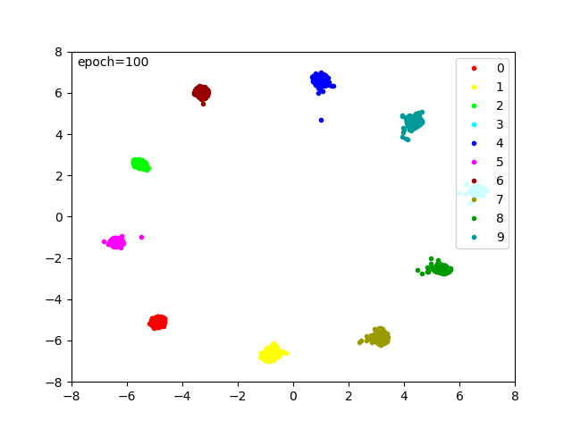

# Metric Learning with MNIST
This library is Metric learning for MNIST.
A model is learned by adding Center Loss for metric learning to NLL Loss for image classification.


# DEMO
#### Feature distribution at epoch 100  

 
 
# Requirement
- python 3.6.8
- pytorch 1.1.0
- torchvision 0.3.0
- scikit-learn 0.20.3
- cuda 9.0
- cudnn 7.1 


# Installation
 
```sh
git clone  https://github.com/iShoto/testpy.git
```


# Usage
 
```sh
$ cd testpy/codes/20200104_metric_learning_mnist/src/
$ python train_mnist_original_center.py
...
Epoch:   1, train acc: 0.209305, train loss: 0.019642, test acc: 0.253963, test loss: 0.018308
Epoch:   2, train acc: 0.302789, train loss: 0.017461, test acc: 0.418725, test loss: 0.016906
Epoch:   3, train acc: 0.455266, train loss: 0.015967, test acc: 0.492158, test loss: 0.015241
Epoch:   4, train acc: 0.531249, train loss: 0.014266, test acc: 0.526375, test loss: 0.013594
Epoch:   5, train acc: 0.609915, train loss: 0.012737, test acc: 0.629488, test loss: 0.012123
...
Epoch:  96, train acc: 1.0     , train loss: 0.000309, test acc: 0.982005, test loss: 0.003887
Epoch:  97, train acc: 0.999983, train loss: 0.000307, test acc: 0.981601, test loss: 0.003929
Epoch:  98, train acc: 1.0     , train loss: 0.000303, test acc: 0.981306, test loss: 0.003924
Epoch:  99, train acc: 1.0     , train loss: 0.000296, test acc: 0.981907, test loss: 0.003937
Epoch: 100, train acc: 1.0     , train loss: 0.000272, test acc: 0.981805, test loss: 0.003965
```


# Author
Shoto I.


# License
[MIT license](https://github.com/iShoto/testpy/blob/master/LICENSE).
