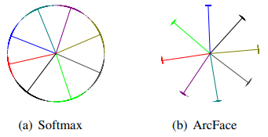

# ResNet18でCIFAR10を距離学習

以前、「[簡易モデルでMNISTを距離学習](http://testpy.hatenablog.com/entry/2020/01/12/171347)」と
「[ResNet18でCIFAR10を画像分類](http://testpy.hatenablog.com/entry/2020/01/04/225231)」
を実施した。
今回はこれらを組み合わせた「ResNet18でCIFAR10を距離学習」を行った。

基本的には「[ResNet18でCIFAR10を画像分類](http://testpy.hatenablog.com/entry/2020/01/04/225231)」
で実施した内容と同じになる。
異なるのはResNet18の最終層の前で特徴抽出して、それを距離損失関数に通してから、損失関数に入力している点である。
なので、全体の説明は「[ResNet18でCIFAR10を画像分類](http://testpy.hatenablog.com/entry/2020/01/04/225231)」
に譲るとして、ここでは距離損失関数の周辺の実装について説明する。
なお、今回利用する距離損失関数は[ArcFace](https://arxiv.org/abs/1801.07698)で、上記で述べたように画像分類モデルに付け足すだけの優れものである。
しかも非常に精度が高い。
なぜ精度が高くなるのかは
「[モダンな深層距離学習 (deep metric learning) 手法: SphereFace, CosFace, ArcFace - Qiita](https://qiita.com/yu4u/items/078054dfb5592cbb80cc)」
が詳しいので、ArcFaceを利用したい人は一読することをお薦めする。

なお、今回説明するコードは
[ここ](https://github.com/iShoto/testpy/tree/master/codes/20200113_pytorch_cifar10_arcface)
に置いてある。


## 概要

実行手順は次の通り。

1. データの取得
2. モデルの定義
3. 距離損失関数の定義
4. 損失関数と最適化関数の定義
5. 学習と検証

「3. 距離損失関数の定義」が今回新たに実装された部分である。
上記の手順はmain()で次のように実行される。

```python
def main():
	# Parse arguments.
	args = parse_args()
	
	# Set device.
	device = 'cuda' if torch.cuda.is_available() else 'cpu'

	# Load dataset.
	train_loader, test_loader, class_names = cifar10.load_data(args.data_dir)
	
	# Set a model.
	model = get_model(args.model_name)
	model = model.to(device)
	print(model)

	# Set a metric
	metric = metrics.ArcMarginProduct(args.n_feats, len(class_names), s=args.norm, m=args.margin, easy_margin=args.easy_margin)
	metric.to(device)

	# Set loss function and optimization function.
	criterion = nn.CrossEntropyLoss()
	optimizer = optim.SGD([{'params': model.parameters()}, {'params': metric.parameters()}],
						  lr=args.lr, 
						  weight_decay=args.weight_decay)

	# Train and test.
	for epoch in range(args.n_epoch):
		# Train and test a model.
		train_acc, train_loss = train(device, train_loader, model, metric, criterion, optimizer)
		test_acc, test_loss = test(device, test_loader, model, metric, criterion)
		
		# Output score.
		stdout_temp = 'epoch: {:>3}, train acc: {:<8}, train loss: {:<8}, test acc: {:<8}, test loss: {:<8}'
		print(stdout_temp.format(epoch+1, train_acc, train_loss, test_acc, test_loss))

		# Save a model checkpoint.
		model_ckpt_path = args.model_ckpt_path_temp.format(args.dataset_name, args.model_name, epoch+1)
		torch.save(model.state_dict(), model_ckpt_path)
		print('Saved a model checkpoint at {}'.format(model_ckpt_path))
		print('')
```


## 2. モデルの定義

画像分類モデルは`get_model()`内で呼び出している。
この時、モデル名を引数として渡す。


```python
model = get_model(args.model_name)
```

今回はResNet18を使うが、ArcFaceに入力する特徴を取得するために、
ResNetFace18というメソッドを作った。

```python
from models.resnet import ResNet18, ResNetFace18

def get_model(model_name):
	...
	elif model_name == 'ResNetFace18':
		model = ResNetFace18()
```

呼び出しているのは、`model`ディレクトリーの`resnet.py`。
以下が中身。
やってることは最終層をコメントアウトしただけ。
これで512次元の特徴が取得できる。

```python
def ResNetFace18(n_feats):
	return ResNetFace(BasicBlock, [2,2,2,2], num_classes=n_feats)


class ResNetFace(nn.Module):
	def __init__(self, block, num_blocks, num_classes=10):
		super(ResNetFace, self).__init__()
		self.in_planes = 64

		self.conv1 = nn.Conv2d(3, 64, kernel_size=3, stride=1, padding=1, bias=False)
		self.bn1 = nn.BatchNorm2d(64)
		self.layer1 = self._make_layer(block, 64, num_blocks[0], stride=1)
		self.layer2 = self._make_layer(block, 128, num_blocks[1], stride=2)
		self.layer3 = self._make_layer(block, 256, num_blocks[2], stride=2)
		self.layer4 = self._make_layer(block, 512, num_blocks[3], stride=2)
		#self.linear = nn.Linear(512*block.expansion, num_classes)

	def _make_layer(self, block, planes, num_blocks, stride):
		strides = [stride] + [1]*(num_blocks-1)
		layers = []
		for stride in strides:
			layers.append(block(self.in_planes, planes, stride))
			self.in_planes = planes * block.expansion
		return nn.Sequential(*layers)

	def forward(self, x):
		out = F.relu(self.bn1(self.conv1(x)))
		out = self.layer1(out)
		out = self.layer2(out)
		out = self.layer3(out)
		out = self.layer4(out)
		out = F.avg_pool2d(out, 4)
		out = out.view(out.size(0), -1)
		#out = self.linear(out)
		return out
```


## 3. 距離損失関数の定義
距離損失関数という言葉が正しいか不明だが、
同じクラスを近くに、異なるクラスを遠くに置くようにするための損失関数を指す。
ArcFaceは、簡単にいうと下図のように円弧上（実際には超球面上）にクラスが適切に分布するように角度を学習する損失関数となる。




```python
metric = metrics.ArcMarginProduct(args.n_feats, len(class_names), s=args.norm, m=args.margin, easy_margin=args.easy_margin)
```


```bash
epoch: 100, train acc: 0.955092, train loss: 0.004396, test acc: 0.847445, test loss: 0.028565
Saved a model checkpoint at ../experiments/models/checkpoints/CIFAR10_ResNetFace18_epoch=100.pth
```


## 参考文献
https://github.com/ronghuaiyang/arcface-pytorch

https://github.com/ronghuaiyang/arcface-pytorch/blob/master/models/resnet.py

https://github.com/ronghuaiyang/arcface-pytorch/blob/master/models/metrics.py
