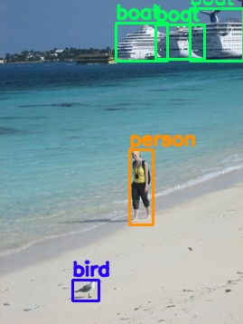

# Visualize Object Detection Annotation data.
Visualizing annotation data for object detection using OpenCV.


# Feature
- General process to draw annotation data for object detection
- Automatic selection of color per object using colormap


# Requirement
- python 3.6.8
- pytorch 1.1.0
- torchvision 0.3.0
- scikit-learn 0.20.3
- cuda 9.0
- cudnn 7.1 


# Installation
 
```sh
git clone https://github.com/iShoto/testpy.git
```

# Usage
 
```sh
$ cd testpy/codes/20200125_visualize_object_detection_annotation_data/src/
$ python utils.py
```




# Author
Shoto I.


# License
[MIT license](https://github.com/iShoto/testpy/blob/master/LICENSE).
