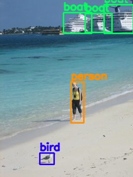

# バウンディングボックスの描画とcolormapによる自動色付け

バウンディングボックスを描画する度に、同じようなコードを何度も書いているので、
いい加減コピペで済むようにしたいと思ったので、ここにまとめておく。
今回はアノテーションデータを描画しているが、検出結果でもコードはほぼ同じ。
物体の色はcolormapによって自動選択できるようにしている。



## 概要

描画コードは以下の通り。
引数は順に、画像パス、アノテーションデータ、colormap（後述）、描画画像の保存パス。
`cv2.rectangle()`でバウンディングボックスを、`cv2.putText()`でラベルを描画している。

```python
def visual_anno(img_path, annos, colormap, drawn_anno_img_path=None):
	# Draw annotion data on image.
	img = cv2.imread(img_path)
	for a in annos:
		color = colormap[a['label_name']]
		cv2.rectangle(img, (a['xmin'], a['ymin']), (a['xmax'], a['ymax']), color, 2)
		text = '{}'.format(a['label_name'])
		cv2.putText(img, text, (a['xmin'], a['ymin']-5), cv2.FONT_HERSHEY_SIMPLEX, 0.7, color, 2, cv2.LINE_AA)

	# Save or show an image.
	if drawn_anno_img_path != None:
		cv2.imwrite(drawn_anno_img_path, img)
	else:
		cv2.imshow('image', img)
		cv2.waitKey(0)
		cv2.destroyAllWindows()
```

## 引数

`visual_anno()`4つの引数は以下の通り。

|引数|説明|
|:--|:--|
|img_path|画像パス。例： ../data/images/2007_006490.jpg|
|annos|アノテーションデータ。ラベル名とバウンディングボックスの座標を含む辞書のリスト。|
|colormap|ラベル名とRBGの辞書。後述するラベル名とcolormap名を入力すると生成できる。|
|drawn_anno_img_path|描画画像パス。例: ../experiments/results/drawin_anno_images/2007_006490.jpg|

`annos`と`colormap`を以下に示す。


```sh
annos = [
	{'label_name': 'bird', 'xmin': 80, 'ymin': 309, 'xmax': 109, 'ymax': 332}
	{'label_name': 'person', 'xmin': 143, 'ymin': 165, 'xmax': 169, 'ymax': 248}
	{'label_name': 'boat', 'xmin': 210, 'ymin': 9, 'xmax': 269, 'ymax': 67}
	{'label_name': 'boat', 'xmin': 172, 'ymin': 27, 'xmax': 226, 'ymax': 65}
	{'label_name': 'boat', 'xmin': 128, 'ymin': 25, 'xmax': 185, 'ymax': 67}
]
```

```
colormap = {'bird': (255, 0, 40), 'boat': (91, 255, 0), 'person': (0, 143, 255)}
```


## OpenCV関数

`cv2.rectangle()`と`cv2.putText()`がある。
[公式ドキュメント](http://opencv.jp/opencv-2svn/cpp/drawing_functions.html)
を参考に以下にまとめておく。

```python
cv2.rectangle(img, topLeft, downRight, color, thickness)
```

|引数|説明|
|:--|:--|
|img|画像|
|topLeft|矩形の左上の座標|
|downRight|矩形の右下の座標|
|color|矩形の色、GRB|
|thichness|矩形の線の太さ|

```python
cv2.putText(img, text, downLeft, fontFace, fontScale, color, thickness, lineType)
```

|引数|説明|
|:--|:--|
|img|画像|
|text|描画するテキスト|
|downLeft|文字列の左下の座標|
|fontFace|フォントの種類。次の中から選ぶ。FONT_HERSHEY_SIMPLEX , FONT_HERSHEY_PLAIN , FONT_HERSHEY_DUPLEX , FONT_HERSHEY_COMPLEX , FONT_HERSHEY_TRIPLEX , FONT_HERSHEY_COMPLEX_SMALL , FONT_HERSHEY_SCRIPT_SIMPLEX , FONT_HERSHEY_SCRIPT_COMPLEX|
|fontScale|フォントスケール（画像サイズによってフォントサイズは変化する）|
|color|フォントの色|
|thickness|フォントの線の太さ|
|lineType|線の種類、基本cv2.LINE_AA（アンチエイリアス）でOK|


## colormap

物体の色分けは自動で適切に割り当ててくれるとありがたい。
[colormap](https://matplotlib.org/examples/color/colormaps_reference.html)
を利用すると簡単に実現できる。

colormapの取得コードは次の通り。
ラベル名のリストとカラーマップ名を入れる。

```python
def get_colormap(label_names, colormap_name):
	colormap = {}	
	cmap = plt.get_cmap(colormap_name)
	for i in range(len(label_names)):
		rgb = [int(d) for d in np.array(cmap(float(i)/len(label_names)))*255][:3]
		colormap[label_names[i]] = tuple(rgb)

	return colormap
```

ラベル名は、`['bird', 'boat', 'person']`のようなリスト。
カラーマップ名は、
[ここ](https://matplotlib.org/examples/color/colormaps_reference.html)
から文字列を選択する。
例えば、`gist_rainbow`は以下のようになる。


`plt.get_cmap(colormap_name)`でカラーマップ`cmap`が取得できる。
`cmap`に0～1の値を入れると特定の色が取得できる。
`gist_rainbow`の場合、0.0が上図の一番左、1.0が一番右を示している。
0.0で赤に近い色、0.4で緑、0.8で青に近い色が取得できる。
1.0以上は同じ色が取得される。
以下に0.1ずつ増やした場合の色の変化を示す。

```python
for i in range(15):
	v = i*0.1
	if i == 11:
		print('=================')
	print(round(v, 1), tuple([int(d) for d in np.array(cmap(v))*255][:3]))
```

```
0.0 (255, 0, 40)  # 赤に近い色
0.1 (255, 93, 0)
0.2 (255, 234, 0)
0.3 (140, 255, 0)
0.4 (0, 255, 0)  # 緑
0.5 (0, 255, 139)
0.6 (0, 235, 255)
0.7 (0, 94, 255)
0.8 (41, 0, 255)  # 青に近い色
0.9 (182, 0, 255)
1.0 (255, 0, 191)
=================
1.1 (255, 0, 191)
1.2 (255, 0, 191)
1.3 (255, 0, 191)
1.4 (255, 0, 191)
```

`get_colormap()`の中で
`rgb = [int(d) for d in np.array(cmap(float(i)/len(label_names)))*255][:3]`
という長い1行があるが、次のような処理を行っている。
簡単に言うと、ラベルごとのRGBを取得している。

```sh
>>> i = 0
>>> label_names = ['bird', 'boat', 'person']
>>> print( float(i)/len(label_names) )
0.0
>>> print( cmap(float(i)/len(label_names)) )
(1.0, 0.0, 0.16, 1.0)
>>> print( np.array(cmap(float(i)/len(label_names))) )
[1.   0.   0.16 1.  ]
>>> print( np.array(cmap(float(i)/len(label_names)))*255 )
[255.    0.   40.8 255. ]
>>> rgb = [int(d) for d in np.array(cmap(float(i)/len(label_names)))*255][:3]
>>> print(rgb)
[255, 0, 40]
>>> print(label_names[i], tuple(rgb))
bird (255, 0, 40)
```
