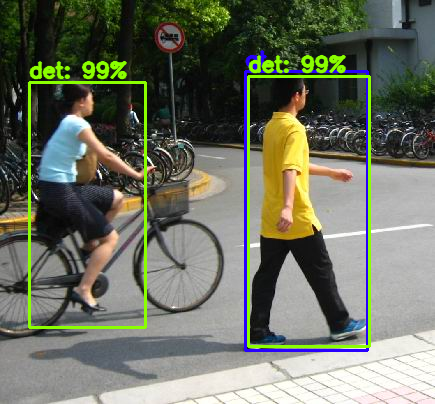
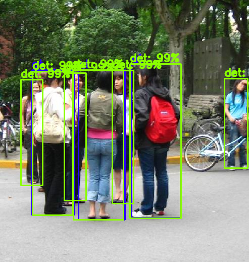
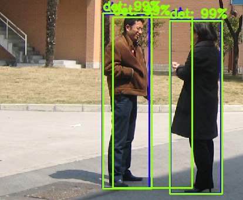

# PyTorchの物体検出チュートリアルを魔改造

[PyTorchの物体検出チュートリアル](https://pytorch.org/tutorials/intermediate/torchvision_tutorial.html)が、
個人的にいじりたい場所が沢山あったので、色々と魔改造してみた。
コードは[こちら](https://github.com/iShoto/testpy/tree/master/codes/20200125_pytorch_object_detection)。


## 概要

チュートリアルではTrainingだけだが、今回はTestに関するコードも実装している。
それを含めて以下が今回魔改造した点。
TrainingとTestで各々3つずつ魔改造ポイントがある。

### 1. Training

- 1.1. データのCSV化  
チュートリアルではデータセットをPyTorchの手続きに従ってクラス化していたが、
自分はどんなデータセットでも、一旦CSVフォーマットに変換してからクラス化している。
CSV化することでPandasのDataFrameにできるので、色々な実験をしたい時に便利。

- 1.2. モデルをFaster RCNNに変更  
ホントは様々なモデルが扱えるmmdetectionが良かったが、自分にはちょっとハードルが高かった。
魔改造第2弾があれば使ってみたい。今回はTorchVision。
チュートリアルではMask RCNNを使っていたが、特にマスクは不要なのでFaster RCNNに変更した。
ただし、これはチュートリアルにも載っている。
あとMask RCNNは、今回は関係ないけど、人のマスクでは頭が真っ平になるのが気に食わない
っていうのもあって敬遠している。

- 1.3. チェックポイントを保存  
チュートリアルではモデル自体保存していないが、テストしたいのでチェックポイントを保存できるようにした。

### 2. Test

- 2.1. 物体検出  
保存したモデルをロードして物体検出を実行。
結果は例によってCSV化している。

- 2.2. スコアをVOC方式で算出  
cocoapiにより、訓練中にCOCO方式で算出されたmAPが出力されるが、出力結果を変数として扱うにはハードルが高かったので、[Cartucho/mAP](https://github.com/Cartucho/mAP)を利用した。
これにより、mAPを変数として取得できるようになり、またTP/FP/Recall/Precisionなども取得できるようになっている。

- 2.3. Ground Truthと検出結果の描画  
タイトルの通り。
スコアを見るだけは分からない具体的な誤検出や未検出の原因を画像で確認する。

### 1. Training

まずはTrainingから。
`train.py`に実装。
訓練自体についてはほとんどタッチしていないが、その前後をいじっている。


#### 1.1 データのCSV化

ファイルは外部化している。
他のデータセットも増やせるよう、データセット用のディレクトリーを用意して、`./datasets/penn_fudan_ped.py`に実装している。
`train.py`の`main()`では以下のように呼び出している。
最終的には、trainとtestのDataLoaderを返しているが、それらを取得するための`get_dataset()`の引数はCSVファイルのパスになる。
CSVファイルは`make_csv()`にデータセットパスとCSV出力パスを渡すことで作成できる。

```python
from datasets import penn_fudan_ped

def main():
	# Get data.
	if not os.path.exists(args.anno_path):
		penn_fudan_ped.make_csv(args.data_dir, args.anno_path)
	train_data_loader, test_data_loader = penn_fudan_ped.get_dataset(args.anno_path)
```

`./datasets/penn_fudan_ped.py`の中身については詳解しないが、
`get_dataset()`はどのデータにも横展開できるコードになっているが、
`make_csv()`はチュートリアルと同様、データセットごとに対応したコードを実装してCSVファイルに落とし込む必要がある。
なおCSVファイルにすることにより、Train時は学習データのフィルタリング、
Test時はスコア算出やバウンディングボックス描画などで利便性が出てくる。


#### 1.2. モデルをFaster RCNNに変更

データとモデルは別ファイルにした方がよいというのが経験から得られているので、
`./src/models.py`に実装している。
ただし、ほとんどチュートリアルに載ってるのをそのまま。
クラス数はTrainingとTestで共通なので、引数として渡すようにしている。

```python
def get_fasterrcnn_resnet50(num_classes, pretrained=False):
	model = torchvision.models.detection.fasterrcnn_resnet50_fpn(pretrained=pretrained)
	in_features = model.roi_heads.box_predictor.cls_score.in_features
	model.roi_heads.box_predictor = FastRCNNPredictor(in_features, num_classes)

	return model
```

#### 1.3. チェックポイントを保存  

モデルの重みを保存しないと、テストだけしたいという時に困るので。
`./src/train.py`の`main()`に以下のように実装している。

```python
# Save a model checkpoint.
model_ckpt_path = args.model_ckpt_path_temp.format(args.dataset_name, args.model_name, epoch+1)
torch.save(model.state_dict(), model_ckpt_path)
print('Saved a model checkpoint at {}'.format(model_ckpt_path))
```

訓練中は以下のように標準出力され、
最後にcocoapiのスコアとチェックポイントを保存した旨が表示される。

```bash
$ python .\train.py
Loading a model...
Epoch: [0]  [ 0/60]  eta: 0:05:40  lr: 0.000090  loss: 0.9656 (0.9656)  loss_classifier: 0.7472 (0.7472)  loss_box_reg: 0.1980 (0.1980)  loss_objectness: 0.0093 (0.0093)  loss_rpn_box_reg: 0.0111 (0.0111)  time: 5.6684  data: 3.8234  max mem: 3548
Epoch: [0]  [10/60]  eta: 0:00:47  lr: 0.000936  loss: 0.7725 (0.6863)  loss_classifier: 0.4681 (0.4597)  loss_box_reg: 0.1726 (0.2008)  loss_objectness: 0.0127 (0.0163)  loss_rpn_box_reg: 0.0070 (0.0095)  time: 0.9561  data: 0.3484  max mem: 4261
Epoch: [0]  [20/60]  eta: 0:00:28  lr: 0.001783  loss: 0.4149 (0.5500)  loss_classifier: 0.2203 (0.3413)  loss_box_reg: 0.1567 (0.1806)  loss_objectness: 0.0127 (0.0188)  loss_rpn_box_reg: 0.0060 (0.0093)  time: 0.4775  data: 0.0011  max mem: 4261
Epoch: [0]  [30/60]  eta: 0:00:19  lr: 0.002629  loss: 0.3370 (0.4652)  loss_classifier: 0.1338 (0.2607)  loss_box_reg: 0.1504 (0.1787)  loss_objectness: 0.0094 (0.0152)  loss_rpn_box_reg: 0.0084 (0.0106)  time: 0.4745  data: 0.0011  max mem: 4261
Epoch: [0]  [40/60]  eta: 0:00:12  lr: 0.003476  loss: 0.2195 (0.3939)  loss_classifier: 0.0534 (0.2088)  loss_box_reg: 0.1345 (0.1620)  loss_objectness: 0.0063 (0.0129)  loss_rpn_box_reg: 0.0094 (0.0102)  time: 0.4814  data: 0.0011  max mem: 4458
Epoch: [0]  [50/60]  eta: 0:00:05  lr: 0.004323  loss: 0.1478 (0.3427)  loss_classifier: 0.0442 (0.1765)  loss_box_reg: 0.0842 (0.1432)  loss_objectness: 0.0021 (0.0118)  loss_rpn_box_reg: 0.0091 (0.0112)  time: 0.5083  data: 0.0014  max mem: 4623
Epoch: [0]  [59/60]  eta: 0:00:00  lr: 0.005000  loss: 0.1176 (0.3073)  loss_classifier: 0.0433 (0.1562)  loss_box_reg: 0.0561 (0.1293)  loss_objectness: 0.0009 (0.0102)  loss_rpn_box_reg: 0.0117 (0.0117)  time: 0.5165  data: 0.0013  max mem: 4623
Epoch: [0] Total time: 0:00:34 (0.5814 s / it)
creating index...
index created!
Test:  [ 0/50]  eta: 0:03:14  model_time: 0.1120 (0.1120)  evaluator_time: 0.0010 (0.0010)  time: 3.8935  data: 3.7785  max mem: 4623
Test:  [49/50]  eta: 0:00:00  model_time: 0.0900 (0.0962)  evaluator_time: 0.0010 (0.0012)  time: 0.0994  data: 0.0006  max mem: 4623
Test: Total time: 0:00:08 (0.1791 s / it)
Averaged stats: model_time: 0.0900 (0.0962)  evaluator_time: 0.0010 (0.0012)
Accumulating evaluation results...
DONE (t=0.01s).
IoU metric: bbox
 Average Precision  (AP) @[ IoU=0.50:0.95 | area=   all | maxDets=100 ] = 0.641
 Average Precision  (AP) @[ IoU=0.50      | area=   all | maxDets=100 ] = 0.987
 Average Precision  (AP) @[ IoU=0.75      | area=   all | maxDets=100 ] = 0.859
 Average Precision  (AP) @[ IoU=0.50:0.95 | area= small | maxDets=100 ] = -1.000
 Average Precision  (AP) @[ IoU=0.50:0.95 | area=medium | maxDets=100 ] = 0.325
 Average Precision  (AP) @[ IoU=0.50:0.95 | area= large | maxDets=100 ] = 0.644
 Average Recall     (AR) @[ IoU=0.50:0.95 | area=   all | maxDets=  1 ] = 0.286
 Average Recall     (AR) @[ IoU=0.50:0.95 | area=   all | maxDets= 10 ] = 0.706
 Average Recall     (AR) @[ IoU=0.50:0.95 | area=   all | maxDets=100 ] = 0.706
 Average Recall     (AR) @[ IoU=0.50:0.95 | area= small | maxDets=100 ] = -1.000
 Average Recall     (AR) @[ IoU=0.50:0.95 | area=medium | maxDets=100 ] = 0.700
 Average Recall     (AR) @[ IoU=0.50:0.95 | area= large | maxDets=100 ] = 0.706
Saved a model checkpoint at ../experiments/models/checkpoints/PennFudanPed_FasterRCNN-ResNet50_epoch=1.pth
```

なお、cocoapiをWindows10で利用する場合、インストールに失敗する場合がある。
その際は[Clone of COCO API](https://github.com/philferriere/cocoapi)を利用すると上手くいった。

### 2. Test

Trainingで保存したモデルの重みをロードして幾つかのTestを行う。

#### 2.1. 物体検出

まずはシンプルに物体検出。
コードは`./src/test.py`の`detect_objects()`を参照。
以下のように検出結果が標準出力される。
これらは例によってCSVファイルに保存される。

```bash
$ python .\test.py
Loading a model from ../experiments/models/PennFudanPed_FasterRCNN-ResNet50_epoch=10.pth
Detecting objects... 100%
========================== DETECTION RESULTS ==========================
   label  score  xmin  ymin  xmax  ymax                                         image_path
0      1  0.999   294   129   447   419  D:/workspace/datasets/PennFudanPed/PNGImages/F...
1      1  0.999   361   135   456   399  D:/workspace/datasets/PennFudanPed/PNGImages/F...
2      1  0.999   207   100   350   382  D:/workspace/datasets/PennFudanPed/PNGImages/F...
3      1  0.999     0   111    88   383  D:/workspace/datasets/PennFudanPed/PNGImages/F...
4      1  0.999    37   100    97   362  D:/workspace/datasets/PennFudanPed/PNGImages/F...
5      1  0.999    40   106    87   268  D:/workspace/datasets/PennFudanPed/PNGImages/F...
6      1  0.998   268    92   397   374  D:/workspace/datasets/PennFudanPed/PNGImages/F...
7      1  0.998   260   191   294   345  D:/workspace/datasets/PennFudanPed/PNGImages/F...
8      1  0.998   262    97   338   357  D:/workspace/datasets/PennFudanPed/PNGImages/F...
9      1  0.999   384   192   551   482  D:/workspace/datasets/PennFudanPed/PNGImages/F...
Detection results saved to ../experiments/results/tables/dets.csv
```

#### 2.2. スコアをVOC方式で算出

`1.1 データのCSV化`で保存したGround TruthのCSVファイルと
`2.1. 物体検出`で保存した検出結果のCSVファイルを照合して、VOC形式のmAPを算出する。
[Cartucho/mAP](https://github.com/Cartucho/mAP)を利用しているが、
以下のようなmAP以外のスコアを得るために`main.py`を回収した`main_ex.py`を
`./src/test.py`の`detect_objects()`から呼び出している。

```bash
Making gt text files: 100%|██████████████████████████████████████████████████████████████████████████████| 50/50 [00:00<00:00, 769.32it/s]
Making det text files: 100%|█████████████████████████████████████████████████████████████████████████████| 50/50 [00:00<00:00, 735.01it/s]
65.53% = 1 AP
mAP = 65.53%
  class_name        ap  recall  precision   gt  n_det   tp  fp
0          1  0.655343     1.0   0.581395  125    215  125  90
Score saved to ../experiments/results/tables/score.csv
```

結果を見るとrecall（=tp/gt）は1.0だが、precision（=tp/n_det）は0.58と低くなっている。
つまり誤検出が多いということだが、具体的には何を誤検出しているのか？
それを`2.3. Ground Truthと検出結果の描画`で確認する。


#### 2.3. Ground Truthと検出結果の描画

`./src/test.py`の`draw_gt_n_det()`を実行すると、
テスト画像の上にGround Truthと検出結果が描画される。
以下のように描画結果（青がGround Truth、黄緑が検出結果）を見てみると、
自転車に載っている人、小さい人、オクルージョンのある人が
アノテーションされておらず、それらを検出しているため誤検出となり、
Precisionの低下を導いていることが分かる。
あと、non-maximum suppressionが上手くできてないというのも原因の１つ。

|||
|:--:|:--:|
|||
|||


## まとめ

[チュートリアル](https://pytorch.org/tutorials/intermediate/torchvision_tutorial.html)だと、
テストがほとんどなかったが、説明したコードを利用すれば基礎な分析はできるようになった。
あとは、訓練時にTorchVisionに依存しているので、mmdetectionなどモデルが多数使えるようにしたり、
[Albumentations](https://github.com/albumentations-team/albumentations)を用いたData Augmentationや、
Schedulerの充実などを行いたい。


## 参考文献

- [TORCHVISION OBJECT DETECTION FINETUNING TUTORIAL - PyTorch](https://pytorch.org/tutorials/intermediate/torchvision_tutorial.html)
- [I can't install cocoapi on Windows 10 · Issue #185 - GitHub](https://github.com/cocodataset/cocoapi/issues/185)
- [Clone of COCO API - GitHub](https://github.com/philferriere/cocoapi)
- [Cartucho/mAP - GitHub](https://github.com/Cartucho/mAP)
- [Albumentations - GitHub](https://github.com/albumentations-team/albumentations)