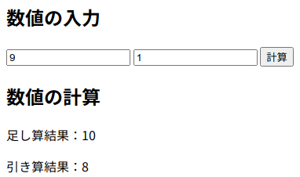

# とにかくDjangoでAjaxのPOSTを機能させる近道

DjangoでAjaxのPOSTを機能させる近道が分かったのでメモ。
ここではDjango-3.0.9を利用。
参考文献の1と2でアプリの画面を表示できるようにして、3でajaxに関連するコードをコピペ＆アプリ名修正したら、簡単に実現できた。
昨日半日ぐらいかけて調べまくったのに実現しなかったけど、今日はすんなりできてしまった。。色々、おまじない的なコードが重要っぽい。
まだよく理解してないけど、実現できたのでよかった。

## 参考文献
1. [Python Django入門 (3)](https://qiita.com/kaki_k/items/7b178ad39394a031b50d)
2. [Python Django入門 (4)](https://qiita.com/kaki_k/items/6e17597804437ef170ae)
3. [【django】Ajaxによる非同期通信：動的にページ更新する方法](https://office54.net/python/django/django-ajax)

