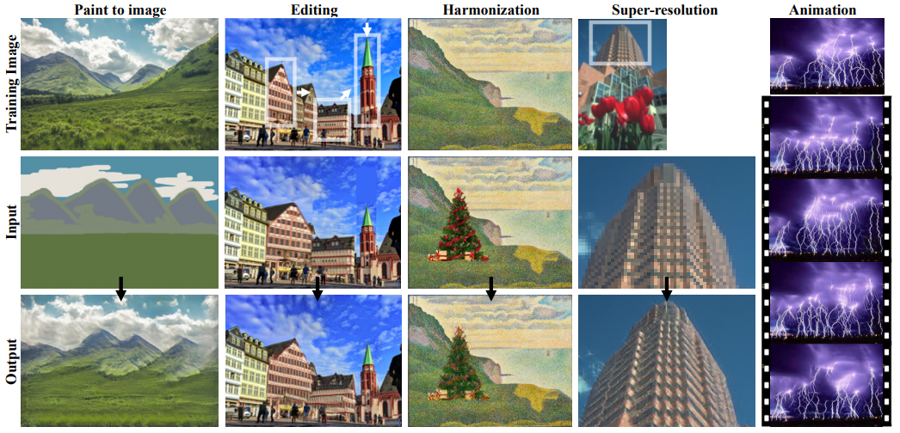
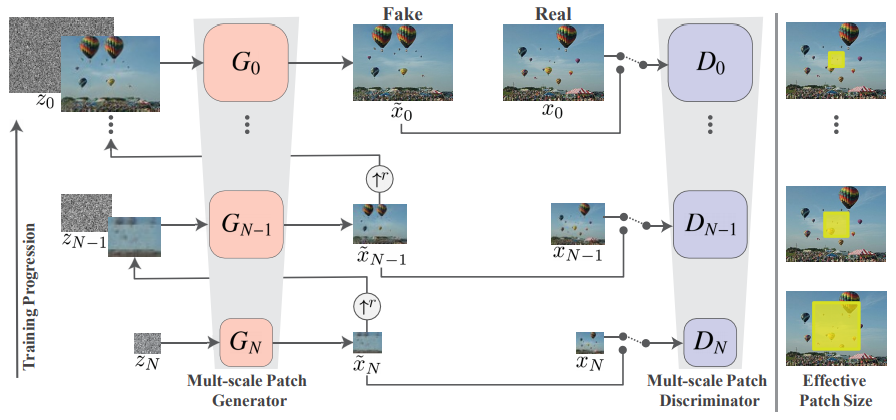
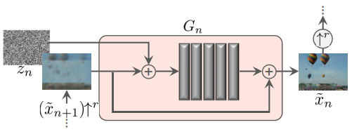
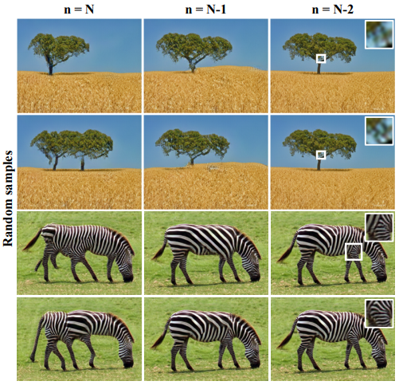
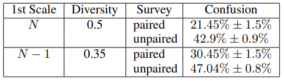
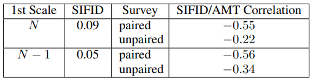
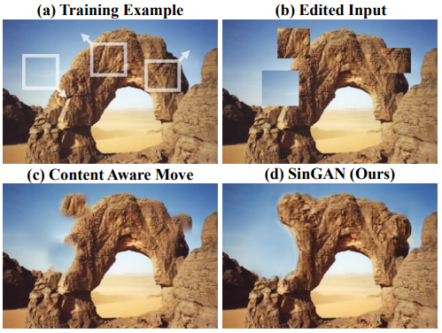
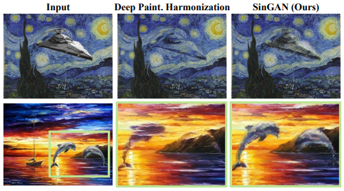

# 【論文解説】SinGAN: Learning a Generative Model from a Single Natural Image

1枚の画像に対して様々な操作が可能な [SinGAN](https://arxiv.org/abs/1905.01164) の論文を簡単にまとめた。SinGANはSingle GANの略。個人的には、ICCV 2019でbest paperだったのと、GANだけど必要な訓練データが1枚なのでリソースが少なくて嬉しいのと、実写画像でも調和的な編集や画像合成ができる、というのが気になって読んでみた。

## 1. メタ情報
- Title: [SinGAN: Learning a Generative Model from a Single Natural Image](https://arxiv.org/abs/1905.01164)
- Authers:  Tamar Rott Shaham, Tali Dekel, Tomer Michaeli
- Conference: ICCV 2019

## 2. 概要
1枚の画像に対して様々な処理を実現する手法。
処理内容は、Paint to Image、Editing、Harmonization、Super Reslution、Single Image Annimation の5つ（Figure 2）。
画像を少しスケールアップさせるGANのピラミッドを構成し、粗い画像から複数の段階を経て精巧な画像を生成するように訓練する。
テスト時に入力する画像とスケールを調整することで、様々な画像の操作を行う。

## 2. 先行研究との差異
従来のGANは特定の操作のためにデザインされているが、本手法は多くの異なる画像操作が可能である。
SinGANと同様、単一の画像を扱うGANはあったが条件付き（特定画像から別画像への変換）であった。そのため、本手法では条件なし（ノイズから画像への変換）を可能にしている。
また、従来のGANでは実写画像が扱えなかった点も本手法で克服している。

## 3. 手法

従来のGANと異なりSinGAN では、画像セットではなく1つの画像からパッチセットを作成して訓練に利用する。
またGANのピラミッドからなるモデルにより、複数の異なるスケールの画像から複雑な画像構造を獲得する。

モデル構造の概要は上図の通り。
スケール $n$ で生成器 $G_n$ は $\tilde{x}_n$ を生成する。
このときは、識別器 $D_n$ が訓練画像をダウンスケールした画像 $x_n$ と区別できないような $\tilde{x}_n$ を生成するように $G_n$ を訓練する。
また $x_n$ と $\tilde{x}_n$ で比較するのは、画像全体ではなく両者で重なり会うパッチごとである。
パッチサイズは画像がスケールアップされるにつれて小さくなる（右端時の黄色矩形）。
スケール $n$ からスケール $n-1$ になる際、 $\tilde{x}_n$ をアップスケールし、ノイズと共に $G_{n-1}$ に入力して $\tilde{x}_{n-1}$ を生成する。
ただし $n=N$ の場合のみ、$\tilde{x}_N$ は ノイズ $z_N$ から生成する。

$G_n$ の具体的な処理は`Figure 5`となり、数式(3)で表される。
$ψ_n$ は Conv(3x3)-BatchNorm-LeakyReLu による畳み込みブロックを5つ連結している。

$$ \tilde{x}_n = (\tilde{x}_{n+1})↑^r + ψ_n(z_n+(\tilde{x}_{n+1})↑^r), $$ (3)

Lossは式(4)のようになる。

$$ \min_{G_n} \max_{D_n} L_{adv}(G_n, D_n) + αL_{rec}(G_n), $$ (4)

$\min_{G_n} \max_{D_n} L_{adv}(G_n, D_n)$ は、いわゆるGANの生成器と識別器の関係。
$L_{rec}(G_n)$は式(5)で示され、アップスケールした画像から生成した画像とダウンスケール元画像のRMSE（root mean squared error）となる。

$$ L_{rec} = || G_n(0,(\tilde{x}^{rec}_{n+1}) ↑^r) − x_n ||^2, $$ (5)

$n<N$ の時はノイズを利用しないが、$n=N$ の時はノイズを利用し、式(5)は $L_{rec} = || G_N(z^*) − x_N ||^2$ となる

## 4. 評価

### 4.1. 異なるスケールから生成した画像の違い

元画像をダウンスケールして各スケールから入力することで、元画像に似た画像が生成される。
入力するスケールに応じて、異なる画像が生成される。
下図では、最も粗い $n=N$ と、それに続く $n=N-1$ と $n=N-2$ から入力した例を示している。
nが小さくなるにつれて、変化が小さくなっている。
$n=N$ では大枠が捉えているが違和感があり、$n=N-1$ では微妙な変化となり、$n=N-2$ では拡大しないと分からないほどの変化となる。
また、生成画像をパッチごとに識別機にかけているので、反射や影の出力が自然に実現できる。
維持したいコンテキストによって入力するスケールを変えるとよい。

### 4.2. 生成画像のリアルさの定性評価

スケール $N$ と $N-1$、元画像と生成画像のpairedと生成画像のunpairedで、リアルかフェイクかを人が見分ける実験を実施。
50%が完全に混乱するという意味。
$N$ と $N-1$ では後者、paired と unpaired でも後者の方が、生成画像をリアルと判断する傾向があった。
先の画像のように、$N-1$ のコンテンツはほぼ完全に維持されるため変化する箇所が微妙であり、unpairedは元画像がないので当然と言えば当然の結果と言える。

### 4.3. 生成画像のリアルさの定量評価

GANの生成画像の評価指標に、FID(Frechet Inception Distance) がある。
FIDは画像間の距離を図ることができるが、複数画像のペアが対象となる。
そこで本論文では、元画像と生成画像の1枚ずつのペアでもFIDが利用できるSIFID(Single Image FID)を提案して評価を行っている。
SIFIDは $N$ が 0.09 、 $N-1$ が 0.05 （低い方がよい）となり、定性評価と同じく $N-1$ の方が元画像に近いことが分かる（左から2番目の列）。
また、SIFIDと定性評価との相関があることも示されている（右端の列）。

### 4.4 画像操作：Editing, Harmonization

色々な操作ができるが、個人的な興味からEditingとHarmonizationのみに絞って解説する。

#### Editing

編集して縮小した画像を入力する。
見ての通り、つなぎ目がシームレスになっている。
粗い画像から徐々に拡大しながら精巧さを向上させる構造を考えると納得できる。
PhotoshopのContent Aware Moveよりも良い結果と言っている。

#### Harmonization

縮小した合成画像を入力する。
Deep Painterly Harmonization(DPH)よりも、前景のオリジナリティが保持されている。
スケール数 $n$ は2～4 が適切で、前景の構造を保ちつつ背景のテクスチャーに上手く変換できるらしい。
（なんとなくDPHもパラメーター調整でいい感じになる気がするが。）

## 5. 所感
SinGANは本当に色々でき、応用範囲も広いと思う。
例えば、HarmonizationができるならStyle Transferもできるとか。
特にHarmonizationは、実写画像の扱いが難しかったので、もし上手くいったらSinGANの発明者の皆さんに感謝したい気持ちでいっぱいです。
